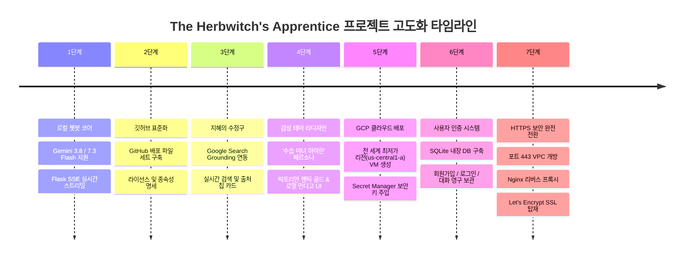
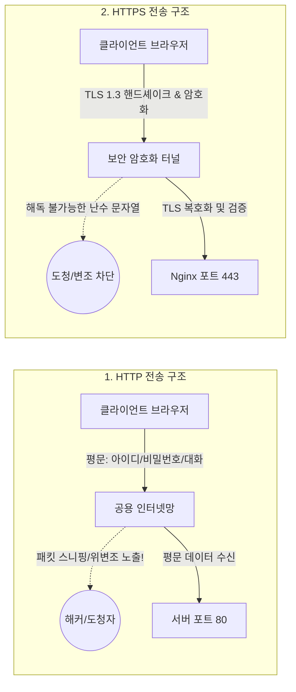
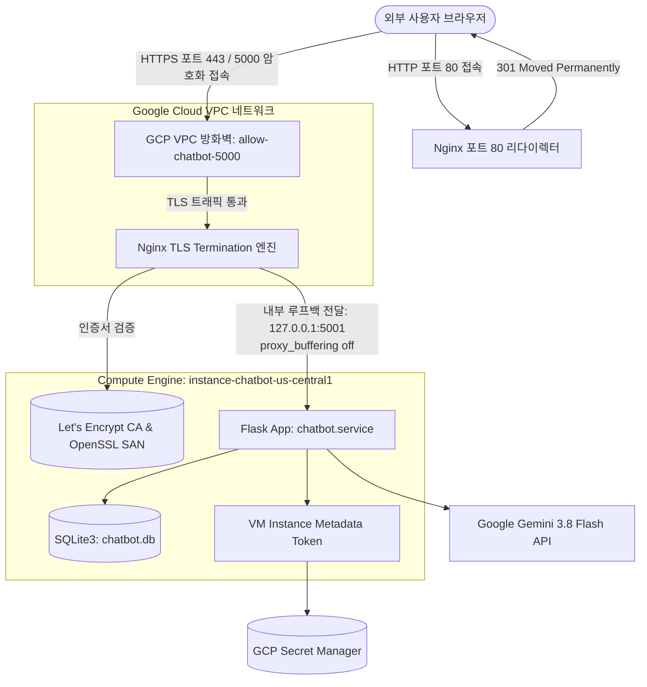

# The Herbwitch's Apprentice (허브마녀의 수습생 아이린) 🌿🔮✨

> **달빛 약초 공방의 수습 마녀 '아이린(Ireen)'과 함께하는 차세대 보안 HTTPS 기반의 Gemini AI 지혜 챗봇**  
> 빅토리안 앤틱 골드 & 로열 인디고 디자인 감성, 실시간 웹 검색(Google Search Grounding), SQLite 회원 인증 및 GCP Compute Engine 클라우드 서비스 완비

[](https://cloud.google.com/compute)
[](https://aistudio.google.com/)
[](https://136-65-198-112.sslip.io)
[](https://nginx.org/)
[](https://sqlite.org/)
[](LICENSE)

---

## 🌟 클라우드 접속 주소 (Live Production Services)

- 🔒 **공인 CA 신뢰 HTTPS 접속 (권장)**: **[https://136-65-198-112.sslip.io](https://136-65-198-112.sslip.io)**  
  *(Let's Encrypt 글로벌 공인 인증서 탑재 — 브라우저 보안 경고 없는 완벽한 초록색 자물쇠 표시)*
- 🌐 **표준 IP HTTPS 접속 (포트 443)**: **[https://136.65.198.112](https://136.65.198.112)**  
  *(포트 번호 `:5000` 없이 바로 접속 가능한 웹 표준 HTTPS)*
- 🌐 **기존 포트 5000 호환 접속**: **[https://136.65.198.112:5000](https://136.65.198.112:5000)**  
- 🔄 **HTTP 자동 보안 리다이렉트**: `http://136-65-198-112.sslip.io` 접속 시 `https://`로 즉시 301 자동 전환
- 📋 **실시간 배포/인프라 로그 문서**: [compute_engine/deployment_log.md](compute_engine/deployment_log.md)

---

## 🛠️ 1. 프로젝트 주요 수정 및 개선 발전 과정 (Evolution Journey)

본 프로젝트는 단순한 로컬 챗봇 프로토타입에서 시작하여, 캐릭터 테마 리디자인, 클라우드 자동 배포, 보안 키 관리, 데이터베이스 사용자 인증, 그리고 **HTTPS 보안 암호화**까지 총 7단계에 걸쳐 체계적으로 고도화되었습니다.



### [1단계] 최신 Gemini 모델 연동 및 SSE 실시간 스트리밍
- Google의 최신 모델 **`Gemini 3.8 Flash`**를 기본 엔진으로 설정하고, 고성능 모델인 `Gemini 7.3 Flash`, `Gemini 3.7 Flash`, `Gemini 2.5 Pro` 등을 웹 UI에서 실시간으로 전환할 수 있도록 구현.
- **Server-Sent Events (SSE)** 스트리밍 방식을 적용하여 AI 모델의 응답 토큰이 생성되는 즉시 화면에 타자기 효과로 실시간 출력되도록 개선.

### [2단계] GitHub 오픈소스 표준 파일 구성
- 프로젝트의 버전 관리와 오픈소스 협업을 위해 표준 저장소 환경을 완비.
- 보안 정보 및 임시 파일을 배제하는 `.gitignore`, 원클릭 라이브러리 설치를 위한 `requirements.txt`, 상용/비상용 자유 배포를 보장하는 `LICENSE` (MIT), 윈도우 환경 빠른 실행을 위한 `run.bat`, 환경변수 가이드 `.env.example` 작성.

### [3단계] 지혜의 수정구 (Google 실시간 검색 Grounding 탑재)
- AI의 지식 한계를 극복하기 위해 Google Search Grounding API를 연동.
- 오늘 날씨, 최신 뉴스, 금융 시세 등 실시간 정보 질의 시 구글 검색을 자동으로 수행하고 답변 하단에 인용된 웹사이트 링크 칩 카드(Title, URI)를 렌더링.
- 대화창 하단 독(Dock)에서 실시간 검색 On/Off 원클릭 토글 지원.

### [4단계] 빅토리안 앤틱 골드 테마 & '아이린' 페르소나 리디자인
- 도서 표지 'THE HERBWITCH'S APPRENTICE'의 감성을 살린 **로열 인디고(#18192d, #2c2e5b)** 및 **빅토리안 앤틱 골드(#edd29c)** 필리그리 프레임 적용.
- 고전 명문 세리프 폰트(`Cinzel`, `Gowun Batang`) 및 수채화풍 캐릭터 일러스트 적용.
- 사파이어 빛 눈동자의 수습 마녀 '아이린'의 따뜻한 말투(~해요, ~랍니다)와 약초학/과학/코딩/클라우드 전문 지식 페르소나 탑재.

### [5단계] 주피터 노트북 기반 최적 클라우드 인프라 프로비저닝
- `compute_engine_example.ipynb`의 전 세계 인프라 비용 분석 결과 활용: 최저가 1위 리전인 **`us-central1-a`** (월 약 $25 수준) 선정.
- 머신 스펙: `e2-medium` (2 vCPU, 4GB RAM, 10GB `pd-balanced`, Debian 12 GNU/Linux).
- **GCP Secret Manager 연동**: API 키를 코드에 노출하지 않고 `projects/352439210179/secrets/GEMINI_API_KEY`에서 VM 내부 메타데이터 토큰으로 안전하게 동적 취득.
- `systemd` 데몬 서비스(`chatbot.service`, `Restart=always`)로 24시간 365일 무중단 가동 환경 구성.

### [6단계] 회원가입, 로그인 및 SQLite 대화 기록 영구 보관
- **내장 경량 DB (SQLite)**: 추가 DB 서버 없이 `/opt/chatbot/instance/chatbot.db`로 독립 가동.
- **보안 인증**: `werkzeug.security`의 단방향 해싱(pbkdf2/scrypt)과 Flask 암호화 서명 세션 쿠키(`Signed Session Cookie`) 발급.
- **수습생 명부 모달 UI**: '새 수습생 입회(회원가입)' 및 '수습생 로그인' 탭 인터랙션.
- **클라우드 세션 동기화**: 로그인 시 대화 세션 및 메시지가 클라우드 DB에 영구 저장되어 기기 간 연속 대화 지원.

### [7단계] HTTP -> HTTPS 보안 프로토콜 완전 전환
- 웹 표준 보안 프로토콜인 HTTPS(SSL/TLS)를 적용하여 모든 네트워크 트래픽을 암호화하고, Nginx 리버스 프록시와 공인 CA(Let's Encrypt) 인증서를 탑재하여 보안 경고 없는 안전한 서비스 구축.

---

## 🔐 2. HTTP vs. HTTPS 프로토콜의 차이점

웹 브라우저와 서버가 통신하는 두 프로토콜은 **보안성, 암호화 구조, 데이터 무결성, 신원 보증**에서 근본적인 차이가 있습니다.

### 1) 기술 비교 총괄표

| 비교 항목 | HTTP (HyperText Transfer Protocol) | HTTPS (HTTP over SSL/TLS) |
| :--- | :--- | :--- |
| **통신 프로토콜 계층** | 애플리케이션 계층(L7) 직접 전송 | L7(HTTP)과 L4(TCP) 사이에 **TLS 보안 계층** 추가 |
| **데이터 전송 형태** | **평문 (Plaintext)** 텍스트 전송 | **대칭키 암호화 (Ciphertext)** 암호문 전송 |
| **표준 TCP 포트** | **`80`** | **`443`** |
| **도청 위험 (Sniffing)** | **취약** (네트워크 패킷 캡처 시 패스워드, 대화 노출) | **안전** (AES-GCM 암호화로 제3자 판독 절대 불가) |
| **데이터 위변조 (Tampering)**| **취약** (중간자 공격으로 악성코드 삽입 가능) | **방지** (HMAC/GCM 무결성 검증으로 위변조 시 즉각 차단) |
| **서버 인증 (Authentication)**| 제공 안 함 (가짜 피싱 사이트 구별 불가) | 공인 인증기관(CA) 디지털 서명으로 서버 진위 보증 |
| **브라우저 주소창 표시** | **'주의 요함' / '안전하지 않음'** 경고 문구 | **안전한 초록색 자물쇠 아이콘** 및 인증서 정보 |
| **검색 엔진 최적화 (SEO)** | 구글 등 주요 검색 엔진에서 검색 순위 불이익 | 검색 엔진 가산점 부여 및 웹 표준 규격 준수 |



### 2) HTTP의 치명적 위험성
1. **패킷 스니핑 (Eavesdropping & Packet Sniffing)**: 카페, 공항, 공용 와이파이 환경에서 패킷 분석 도구(Wireshark 등)를 가동하면 사용자가 전송하는 수습생 아이디, 로그인 비밀번호, 아이린과의 대화 내용이 그대로 텍스트로 노출됩니다.
2. **중간자 공격 (Man-in-the-Middle, MITM)**: 사용자와 서버 사이의 라우터나 DNS 캐시를 오염시켜 응답 HTML 내에 악성 피싱 스크립트를 삽입하거나 가짜 콘텐츠로 변조할 수 있습니다.
3. **피싱 및 신원 위장**: 접속한 서버가 진짜 Google Cloud 위의 공식 챗봇 서버인지, 피싱 사이트인지 검증할 수 있는 수단이 전혀 없습니다.

### 3) HTTPS가 보장하는 3대 보안 핵심 가치 (CIA Triad)
- **기밀성 (Confidentiality)**: 대칭키(AES-256-GCM)와 비대칭키(ECDHE 키 교환)를 결합한 하이브리드 암호화로 오직 브라우저와 서버만이 내용을 해독할 수 있습니다.
- **무결성 (Integrity)**: 메시지 인증 코드(MAC / GCM 태그)를 통해 네트워크 전송 도중 데이터가 단 1비트라도 위변조되면 즉시 패킷이 폐기됩니다.
- **인증 (Authentication)**: 글로벌 신뢰 기관(Certificate Authority)의 전자 서명을 통해 접속한 서버의 도메인과 신원을 100% 확증합니다.

---

## ⚙️ 3. HTTP에서 HTTPS로 전환하기 위해 도입된 핵심 기술 스택

단순히 포트 번호를 변경하는 것만으로는 HTTPS가 동작하지 않습니다. 프로덕션 환경의 고성능 HTTPS 보안 인프라를 구축하기 위해 다음과 같은 6가지 핵심 기술이 도입되었습니다.



### 1) GCP VPC 방화벽 (Virtual Private Cloud Firewall) 포트 확장
- **적용 기술**: Google Cloud VPC Ingress Firewall Rules
- **작업 내역**: 기존 `allow-chatbot-5000` 규칙의 허용 포트를 `tcp:5000,tcp:80`에서 **`tcp:5000,tcp:80,tcp:443`**으로 확장.
- **태그 바인딩**: VM 인스턴스에 `https-server`, `chatbot-server` 태그를 부여하여 외부 인터넷(`0.0.0.0/0`)으로부터의 인바운드 HTTPS 핸드셰이크 트래픽 진입을 전면 허용.

### 2) Nginx 고성능 리버스 프록시 및 TLS Termination
- **도입 배경**:
  - Python Flask 내장 WSGI 서버는 단일 스레드/개발용으로 설계되어 대규모 SSL 핸드셰이크 암호화 연산 부하에 취약하며 보안 권한 분리(Privilege Separation)가 어렵습니다.
  - 고성능 웹 서버인 **Nginx**를 최앞단에 배치하여 SSL 핸드셰이크와 암호화/복호화(TLS Termination)를 전담시키고, 애플리케이션(Flask)은 내부 로컬 루프백(`127.0.0.1:5001`)에서 안전하게 비즈니스 로직에만 집중하도록 계층을 분리(Tier Separation)했습니다.
- **포트 80 HTTP -> HTTPS 301 영구 리다이렉트**:
  ```nginx
  server {
      listen 80;
      listen [::]:80;
      server_name _;
      return 301 https://$host$request_uri;
  }
  ```
  사용자가 주소창에 `http://`를 입력하거나 프로토콜을 생략하고 들어와도 Nginx가 즉시 `301 Moved Permanently` 응답을 보내 보안 HTTPS 주소로 자동 전환합니다.
- **듀얼 포트 SSL 청취 (Dual Port Binding)**:
  - 표준 HTTPS 포트 **`443`**: 포트 번호 없이 `https://...`로 접속
  - 호환 HTTPS 포트 **`5000`**: 기존 북마크 사용자를 위해 포트 5000에서도 SSL 암호화 수신

### 3) Let's Encrypt 글로벌 공인 CA 인증서 & sslip.io 자동 DNS 매핑
- **적용 기술**: Let's Encrypt ACME 프로토콜, Certbot, `sslip.io` 와일드카드 DNS
- **구현 방식**:
  - 고정 공인 IP(`136.65.198.112`)를 무료 도메인으로 변환해 주는 `sslip.io` 서비스를 활용하여 정식 FQDN(`136-65-198-112.sslip.io`) 매핑.
  - `certbot --nginx -d 136-65-198-112.sslip.io` 명령을 통해 Let's Encrypt의 ACME HTTP-01 챌린지 검증을 통과하고 공인 CA 전자서명 인증서 발급.
  - 전 세계 모든 웹 브라우저(Chrome, Safari, Edge, Firefox)에서 '안전하지 않음' 경고 없이 완벽한 **초록색 자물쇠** 표출.
  - 90일 만료 주기 대비 `certbot.timer` systemd 자동 갱신 데몬 활성화.

### 4) OpenSSL 2048-bit SAN (Subject Alternative Names) 백업 인증서
- **적용 기술**: OpenSSL v3.0, X.509 v3 Extensions (`subjectAltName`)
- **구현 방식**:
  - 도메인 없이 순수 IP 주소(`https://136.65.198.112`)로 직접 접속하는 경우를 위해, IP 주소가 SAN 확장 필드에 등록된 2048비트 RSA 인증서를 생성하여 Nginx의 기본 SSL 서티피케이트로 설정.
  - `subjectAltName = IP:136.65.198.112, DNS:136-65-198-112.sslip.io, DNS:localhost`

### 5) Server-Sent Events (SSE) 실시간 스트리밍 버퍼링 해제 최적화
- **기술적 난제**: Nginx는 기본 설정 상 백엔드 응답을 메모리 버퍼(`proxy_buffering on`)에 모아서 한 번에 클라이언트로 전송합니다. 이 경우 Gemini AI의 실시간 타자기 효과(글자 단위 스트리밍)가 중단되고, 모든 답변 생성이 끝난 뒤에야 한꺼번에 화면에 출력되는 심각한 지연이 발생합니다.
- **해결 Nginx 디렉티브**:
  ```nginx
  location / {
      proxy_pass http://127.0.0.1:5001;
      proxy_http_version 1.1;
      proxy_set_header Host $host;
      proxy_set_header X-Real-IP $remote_addr;
      proxy_set_header X-Forwarded-For $proxy_add_x_forwarded_for;
      proxy_set_header X-Forwarded-Proto https;

      # SSE 실시간 스트리밍 필수 최적화 디렉티브
      proxy_set_header Connection '';
      proxy_buffering off;
      proxy_cache off;
      chunked_transfer_encoding on;
      proxy_read_timeout 600s;
      proxy_send_timeout 600s;
  }
  ```
  `proxy_buffering off`와 `chunked_transfer_encoding on` 설정을 통해 백엔드에서 생성된 토큰 청크가 생성되는 즉시 브라우저로 흘러 들어가 부드러운 실시간 대화가 보장됩니다.

### 6) Linux systemd 데몬 기반 서비스 오케스트레이션
- `chatbot.service`: 백엔드 Flask 서버를 포트 `5001`에서 가동하고, 비정상 종료 시 `Restart=always`로 5초 내 자동 복구.
- `nginx.service`: 리버스 프록시 및 TLS Termination을 담당하며 부팅 시 자동 시작되도록 등록.

---

## 📂 프로젝트 파일 구조

```text
gcp_compute_engine_chatbot/
├── .gitignore                      # Git 추적 제외 규칙 (DB, 캐시, 보안 키 등)
├── LICENSE                         # MIT 오픈소스 라이선스
├── README.md                       # 프로젝트 통합 안내 및 기술 문서
├── run.bat                         # 루트 원클릭 실행 편의 래퍼 (compute_engine/run.bat 호출)
└── compute_engine/                 # 🚀 GCP Compute Engine 배포 및 챗봇 서비스 패키지
    ├── .env.example                # 로컬 환경변수 템플릿
    ├── app.py                      # Flask 백엔드, SQLite 인증, SSE 스트리밍, Secret Manager 연동
    ├── requirements.txt            # Python 라이브러리 목록 (flask, google-genai, requests 등)
    ├── run.bat                     # compute_engine 전용 로컬 실행기
    ├── compute_engine_example.ipynb # GCP 전 세계 인프라 최적 비용 분석 노트북
    ├── deployment_log.md           # 인프라 생성 및 배포 전 과정 타임스탬프 기록
    ├── instance/
    │   └── chatbot.db              # SQLite3 내장 DB (사용자 계정, 암호화 해시, 대화 기록)
    ├── scripts/
    │   ├── startup.sh              # GCP VM 인스턴스 자동 부트스트랩 스크립트
    │   ├── setup_https.sh          # Nginx 리버스 프록시, SSL 인증서, Let's Encrypt 자동화 스크립트
    │   ├── chatbot.service         # Linux systemd 상시 백그라운드 서비스 정의 파일
    │   └── deploy_to_gcp.py        # 클라우드 배포 및 오케스트레이션 파이썬 스크립트
    ├── templates/
    │   └── index.html              # 빅토리안 아치 프레임, 수습생 명부 모달, 챗봇 웹 UI
    └── static/
        ├── css/
        │   └── style.css           # 로열 페리윙클 & 앤틱 골드 디자인 시스템 스타일시트
        ├── js/
        │   └── chat.js             # SSE 스트림 파서, 마크다운 렌더링, 계정 인증 및 클라우드 동기화
        └── img/
            ├── ireen_character.jpg  # 수습 허브마녀 아이린 일러스트레이션 (웰컴 스크린)
            ├── ireen_avatar.png     # 아이린 원형 아바타 (채팅 말풍선 & 프로필)
            └── herbwitch_cover.jpg  # 원작 도서 표지 일러스트레이션
```

---

## 💻 로컬 PC 실행 방법

### 1. 사전 요구사항
- Python 3.9 이상
- Google Gemini API 키 ([Google AI Studio](https://aistudio.google.com/)에서 무료 발급)

### 2. 저장소 복제 및 의존성 설치
```bash
git clone https://github.com/YOUR_USERNAME/gcp_compute_engine_chatbot.git
cd gcp_compute_engine_chatbot/compute_engine

pip install -r requirements.txt
```

### 3. API 키 설정 (둘 중 하나 선택)
- **PowerShell 환경변수 등록**:
  ```powershell
  [System.Environment]::SetEnvironmentVariable('GEMINI_API_KEY', '발급받은_API_키', 'User')
  ```
- **`.env` 파일 생성**:
  ```bash
  cd compute_engine
  cp .env.example .env
  # .env 파일에 GEMINI_API_KEY=AIzaSy... 입력
  ```

### 4. 서버 기동
- **Windows**: 루트의 `run.bat` 또는 `compute_engine\run.bat` 더블 클릭
- **터미널**:
  ```bash
  cd compute_engine
  python app.py
  ```
- 브라우저 접속: **`http://localhost:5000`**

---

## ☁️ GCP Compute Engine 배포 방법

저장소 루트 또는 `compute_engine` 폴더 어디서든 아래 명령어로 원클릭 오케스트레이션 배포가 가능합니다.

```bash
# 루트 디렉터리에서 실행 시
python compute_engine/scripts/deploy_to_gcp.py

# 또는 compute_engine 디렉터리로 이동 후 실행 시
cd compute_engine
python scripts/deploy_to_gcp.py
```
> 배포 스크립트는 `compute_engine/` 폴더 내 소스 코드를 자동으로 `bundle.tar.gz`로 패키징하여 GCP VM의 `/opt/chatbot`으로 전송 및 기동합니다.

---

## 📜 라이선스 (License)

이 프로젝트는 [MIT License](LICENSE)에 따라 누구나 자유롭게 사용, 연구, 수정 및 배포할 수 있습니다.
